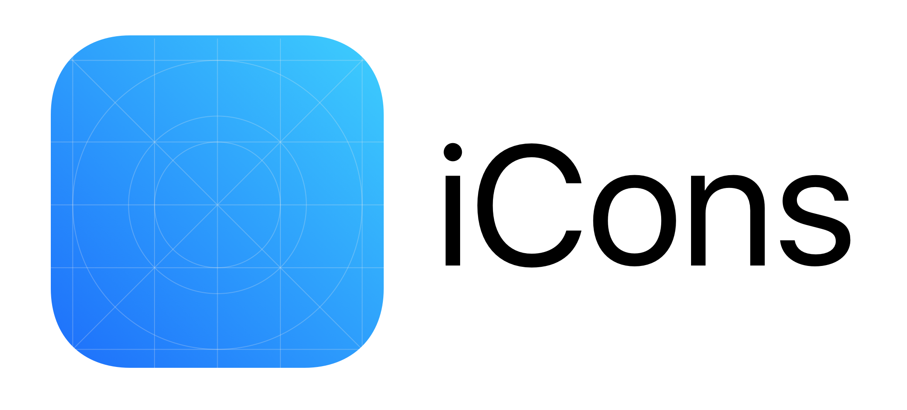

# iCons for Sketch

> *A project brought to you by [Agisilaos Tsaraboulidis](https://twitter.com/agisilaosts)*

iCons is a Sketch plugin that provides a means to create a set of App icons for iOS.

:package: [Download Plugin (.zip)]() | :star: [Changelog]() | 
--- | --- | ---

